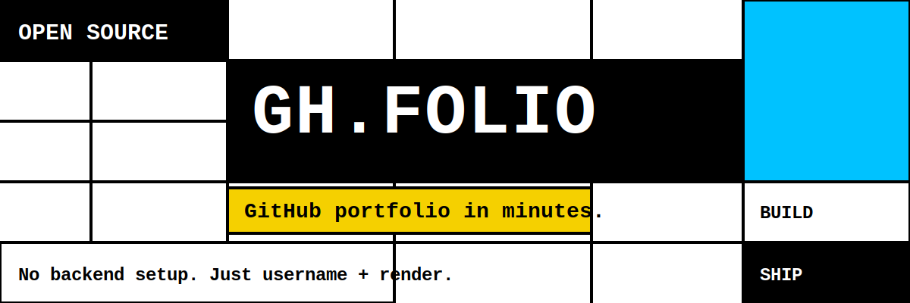
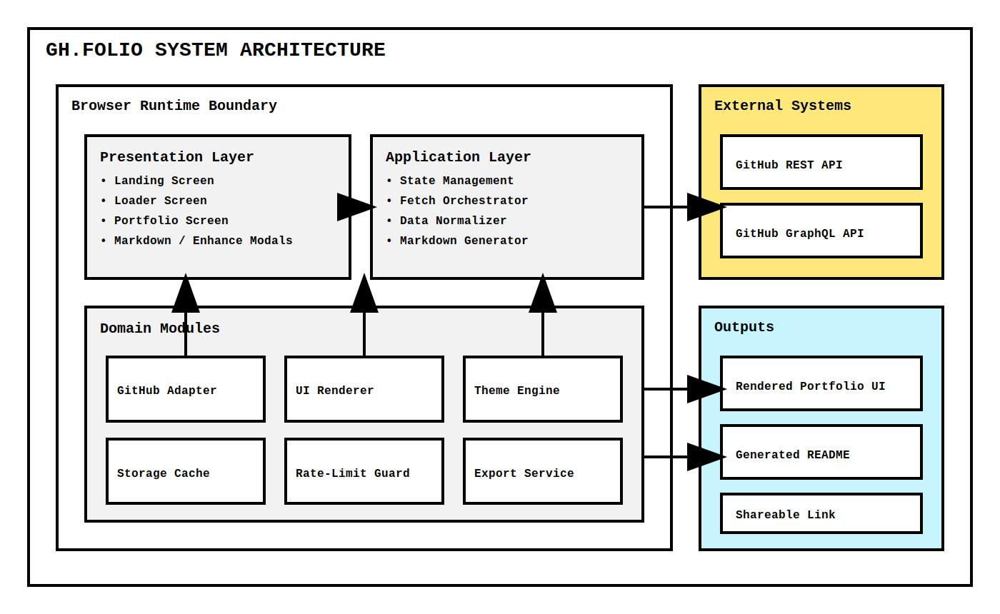
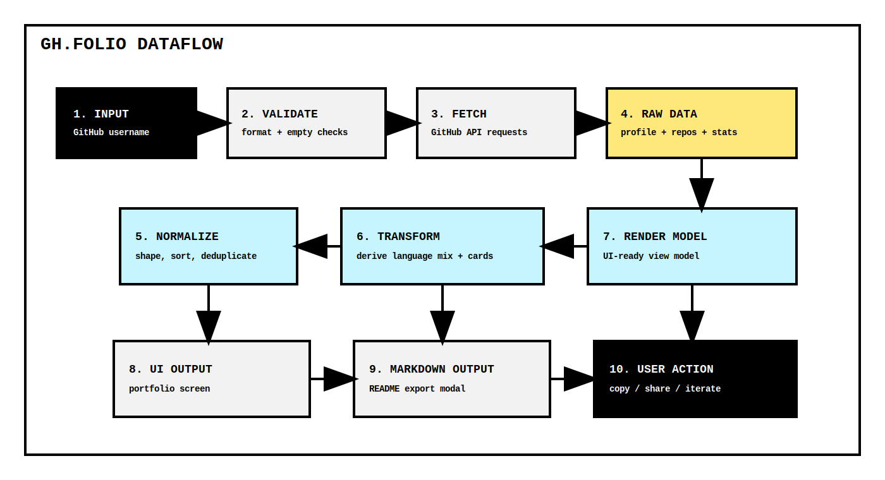
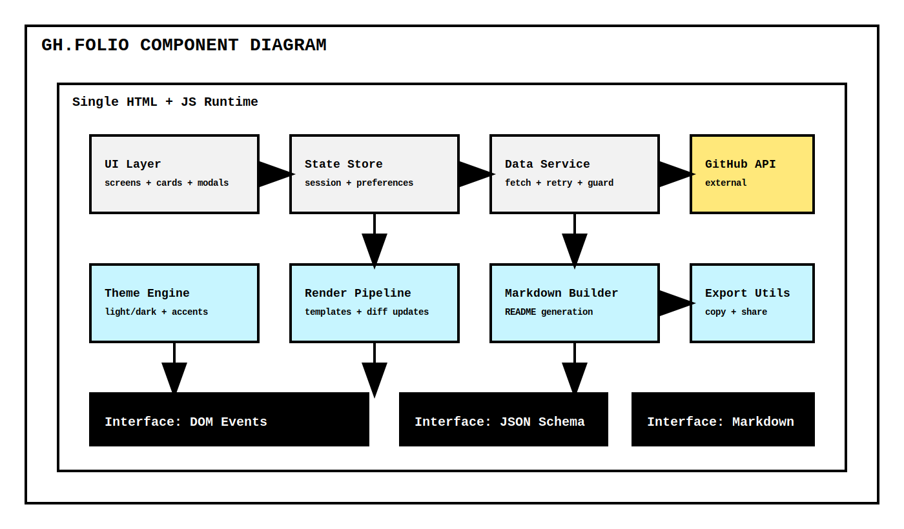

# GH.FOLIO



## Description

GH.FOLIO is a single-page GitHub portfolio builder that turns a username into a polished, share-ready developer profile.

The app pulls public GitHub data, organizes it into opinionated sections, and renders a portfolio view with filters, stats, social links, and markdown export tooling. It is intentionally dependency-light, browser-native, and fast to deploy.

## Features

- Username-driven portfolio generation from public GitHub data
- Multi-screen UX: landing, loading, and portfolio render states
- Repository sorting, language filters, and quick search
- Theme controls (light/dark + accent palette switching)
- Markdown profile generation and copy-to-clipboard workflow
- Optional enhanced profile metadata (bio, social, skills, timeline entries)
- Local persistence for preferences and recent lookups
- Open Graph and social meta tags for cleaner sharing

## Architecture



### Layers

- Presentation Layer: screens, cards, modals, toolbar actions
- Application Layer: orchestration, transformation, state flow
- Domain Modules: API adapter, renderer, theming, cache, export
- External Systems: GitHub REST/GraphQL endpoints
- Outputs: rendered UI and generated markdown artifacts

### Design Notes

- Runtime boundary is the browser; no server required for core experience.
- Data retrieval and UI rendering are decoupled to keep refresh and export logic testable.
- Rate-limit handling is treated as a first-class path, not an exception path.

## Dataflow



Input starts with a GitHub username, then moves through validation, API fetch, normalization, derivation (language and stats modeling), and finally two primary outputs: portfolio UI and markdown export.

## Installation

### Prerequisites

- A modern browser (Chromium, Firefox, Safari, or Edge)
- Optional: any static file server for local development

### Quick Start

1. Clone the repository.
2. Open github-portfolio.html directly in your browser.

### Local Server (recommended)

If you prefer a local server:

```bash
# Python 3
python -m http.server 8080
```

Then open <http://localhost:8080/github-portfolio.html>.

## Usage

1. Enter a GitHub username on the landing screen.
2. Load profile data and wait for portfolio render.
3. Refine presentation with sort, filter, and theme controls.
4. Open markdown tooling to generate and copy profile content.
5. Share or iterate until your profile no longer looks like everyone else.

## Configuration

This project is mostly zero-config, but you can tune behavior directly in the HTML:

- Meta tags: Open Graph and Twitter fields in the head section
- Theme tokens: CSS variables under :root and data-theme/data-accent maps
- Request behavior: fetch and retry logic in the JavaScript app section
- UI defaults: initial screen state, selected accent, and sorting mode

If adding authenticated API access, use a token input path and keep it ephemeral (session-only storage) unless users explicitly opt in.

## API

### External APIs

- GitHub REST API endpoints for user profile and repositories
- Optional GraphQL usage for batched reads and richer portfolio fields

### Internal Contracts

- Input contract: string username
- Normalized profile contract: identity, bio, socials, counts
- Normalized repository contract: name, description, language, stars, forks, updated date
- Output contract: render model for cards, stats, language bars, and markdown blocks

## Examples

### Generate Portfolio

```text
Input: octocat
Output: Full portfolio view with profile, stats, language distribution, pinned/highlighted repositories, and generated README markdown.
```

### Markdown Export Flow

```text
Input: Loaded profile state
Action: Open markdown modal -> copy content
Output: Clipboard-ready markdown for GitHub profile README
```

## Limitations

- Anonymous GitHub API usage is rate-limited.
- Network failures and private profile data can reduce completeness.
- Single-file architecture is fast to ship but harder to scale for large feature sets.
- Rendering and data logic are co-located, which increases maintenance cost over time.

## Future Work

- Split into modular TypeScript architecture with clear domain boundaries
- Add test coverage (unit + integration + visual snapshots)
- Add pluggable templates for multiple portfolio styles
- Add optional authenticated mode for higher API quotas
- Add i18n and accessibility auditing automation
- Add CI workflow for linting, SVG validation, and release packaging

## Component Diagram



## License

MIT. See [LICENSE](./LICENSE).
